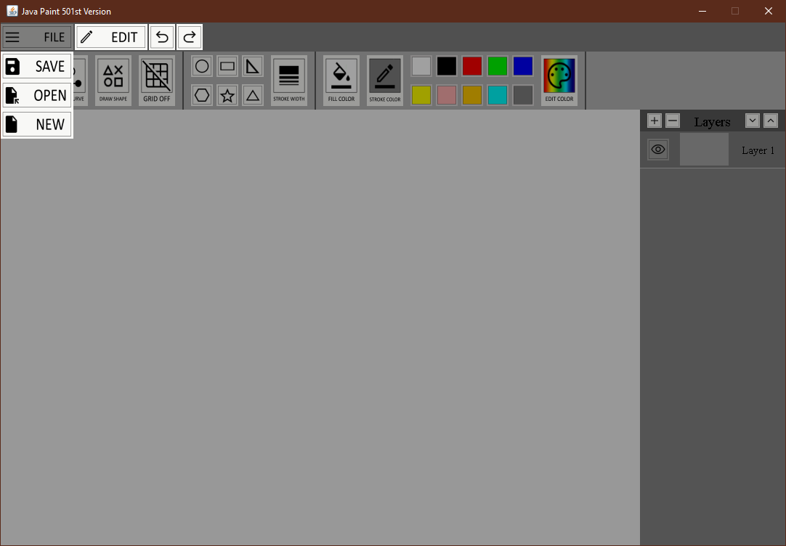
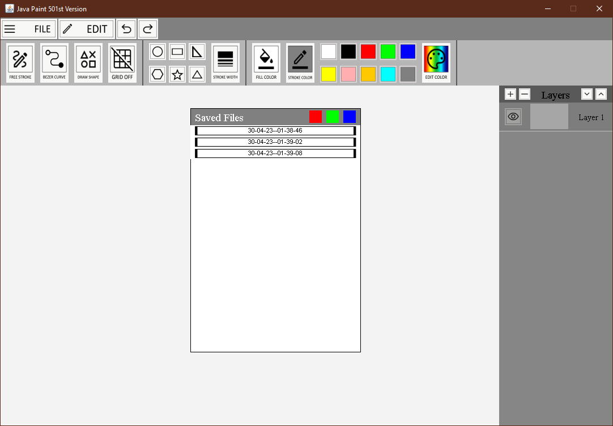
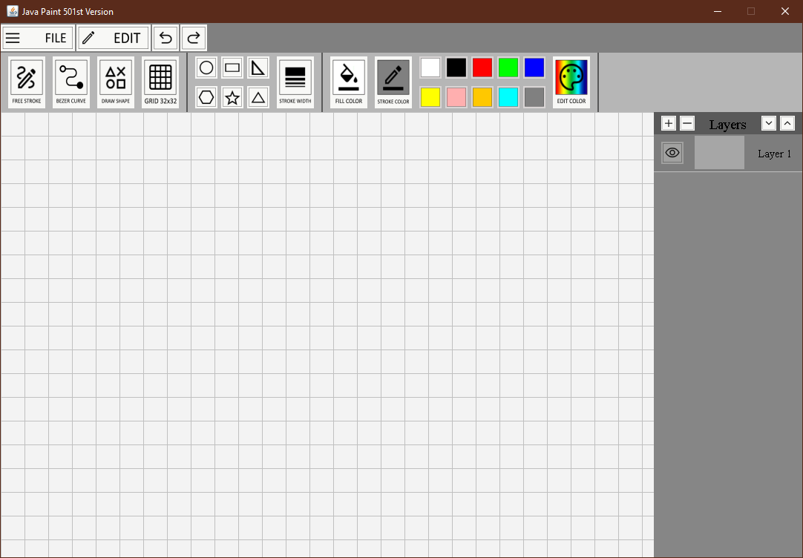
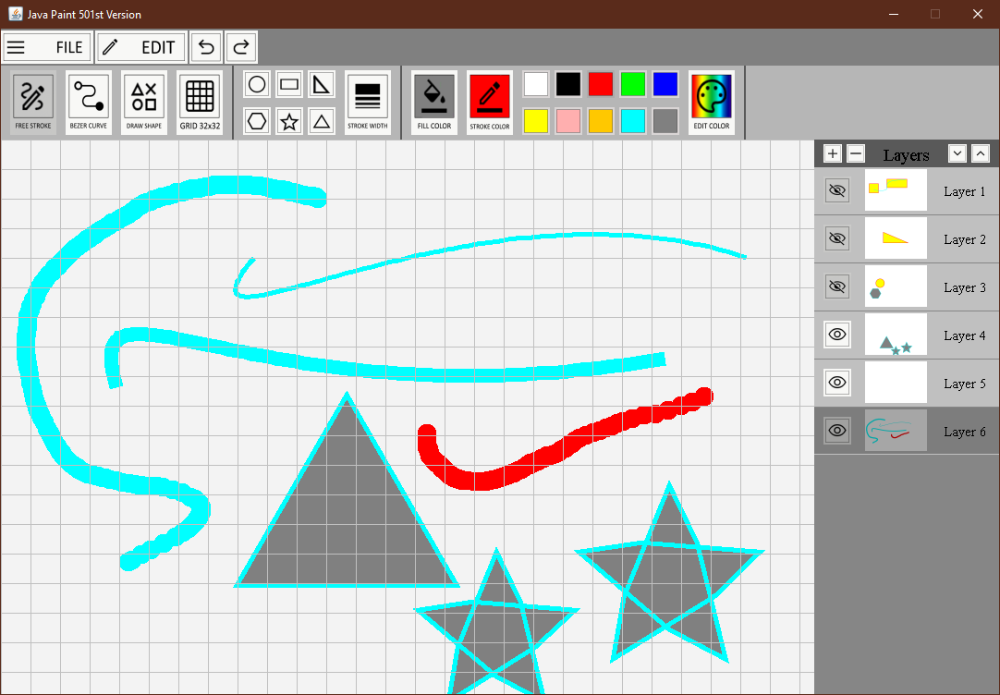
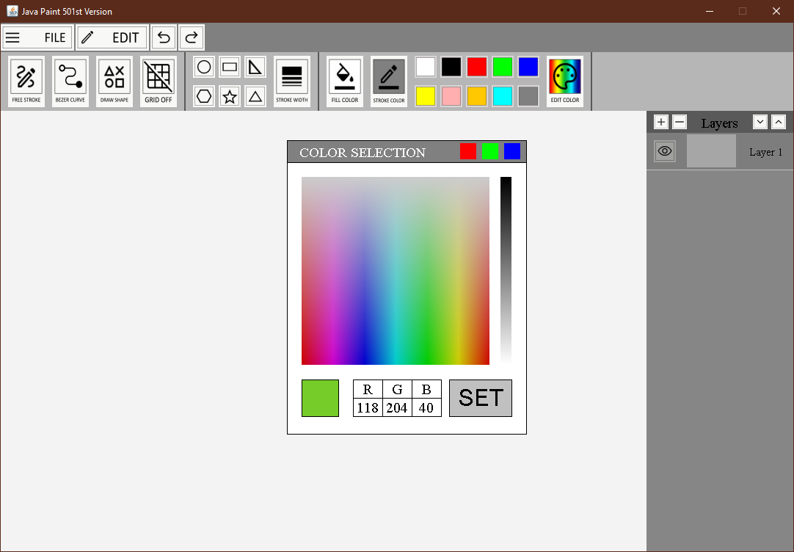

# Java Paint 501st Version
A painting app made on java as part of my assignment for my OOP course. It uses my self-made UI components which includes button, toolbars and windows. The shapes are also implemented by myself. It works pretty fine

# Features
- Free Drawing, Cubic Bezeir Curve, and Shapes
- Layers with arrangment and visibility modifiers
- Color Gradient to choose any color
- Changeable stroke width
- Multisize Grid
- File Saving and Opening
- Undo/Redo 
- Shortcuts
- Tooltips
- Six Shapes

# Screenshots

# Installation
The app can be run by running the SwingTimeEx.java in [src/swingcomponents](src/swingComponents/SwingTimerEx.java). Make sure the folder structure remains as it is unless you know what you are doing

# Usage
## Selecting Color:
Choose what you want to change (fill or stroke) then click on the pre-defined color boxes. To use a custom color, click on edit color, choose your color and then click on set. As the name suggests, stroke color is outline color (and the main color for free-drawing and bezier curve), while fill color is fill of shapes.

## Drawing:
 There are 3 mains drawing options. All things are drawn on selected layers

1. Free Drawing:

    After selecting color, click on freedrawing button. You can draw freely by clicking and dragging. Once you release mouse the shape gets saved as a whole. Undo/Redo will work on the whole shape. 
2. (Cubic) Bezier Curve

    After selecting color, click on Bezeir curve button. Since this is cubic bezeir curve it needs 4 clicks to set its points. You can see the curve shape in real time

3. Shapes

    After selecting color, click on Shapes button, then select any shape from the predefined 6 shapes. Click and drag to draw shapes. 

# Bugs and Issues
- Redo gets lost when you change layers
- Some minor bugs which shouldn't effect working
- If you find some then feel free to open issue

# Sources Used

-Icons taken from https://fonts.google.com/icons